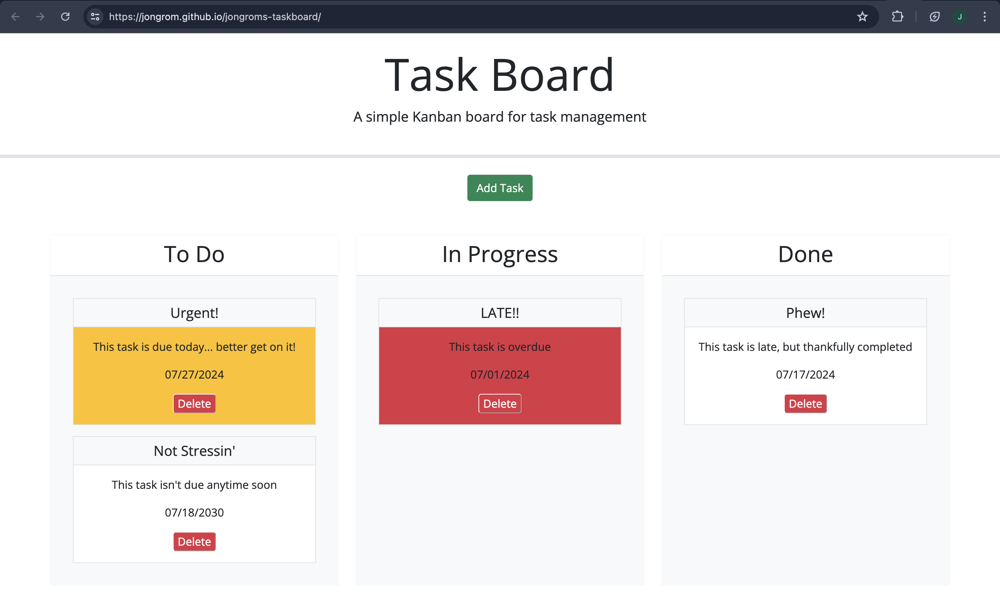

# Taskboard Homework

In this assignment I used Bootstrap, jQuery, jQuery UI and Dayjs to write javascript code to design a kanban board. A modal was built to input each task's title, description, and due date (Bootstrap). Functions were written that build cards (jquery), determine their urgency (dayjs), render cards on the page, incorporate drag and drop functionality for updating a task's progress (jquery ui), and handle the deletion of a task when its delete button is clicked. All additional styling was also done with Bootstrap. 

## Link to Deployed Version
[Click here to see the deployed version](https://jongrom.github.io/jongroms-taskboard/)

## Screenshot of the Deployed Version
